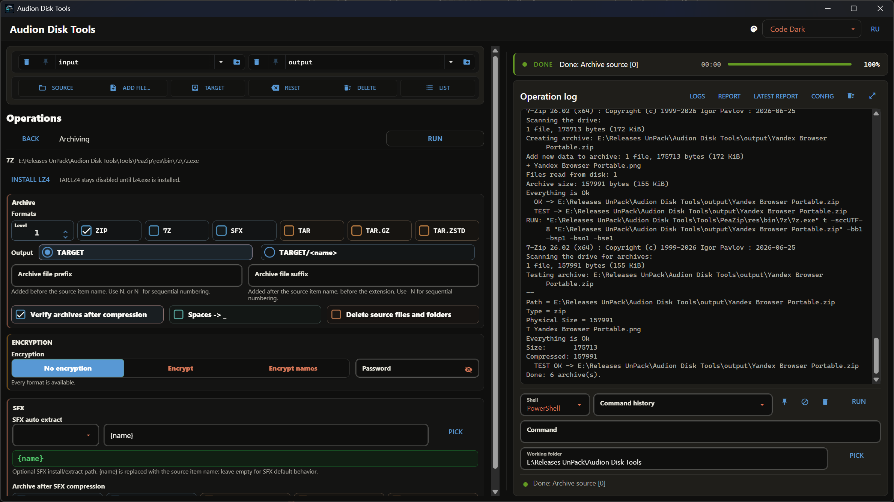

# Audion Disk Tools

<!-- audion:release -->
[](https://audion.dev/downloads/disk-tools) [](https://github.com/Tensionix/disk-tools/releases/latest) [](https://github.com/Tensionix/disk-tools/releases) [](https://github.com/Tensionix/disk-tools/blob/main/LICENSE)

**Version 4.0.0** · 2026-08-25 · 231.2 MB

- [Direct download](https://audion.dev/get/disk-tools/4.0.0/Audion_Disk_Tools_v4.0.0_Full.zip) — unmetered, no rate limits
- [Project page](https://audion.dev/downloads/disk-tools) — every version and how to install



`SHA-256: d1d8decaddee9399d47c9d5ee779a31d0f4e3690c041a8907a2d9f8e0c72f42b`

---

An **Audion** tool, published by [Tensionix](https://github.com/Tensionix).
<!-- /audion:release -->

Portable-first Windows disk and file operations toolkit for audit, compare, sync, backup mirror, very broad file-type filtering, powerful archiving, network/SMB workflows, and native RClone operations from one GUI/CLI tool.

The project is no longer centered on two fixed project folders. In the GUI you can choose any **Source** and any **Target**, work directly with external drives, network paths, and large directories, list source files, synchronize, or build archives without copying terabytes into the project first.

At a glance:

- **Source / Target** — a working route over any folder visible to Windows/Python.
- **Filter** — grouped and individual extension masks for documents, development, media, archives, apps, temporary files, and custom patterns.
- **Operations** — compare, one-way sync, two-way sync, hard mirror, quarantine mirror, Manifest / Diff, and masked copy.
- **Archiving** — ZIP, 7Z, SFX, TAR, TAR.GZ, TAR.ZSTD, plus optional TAR.LZ4 when `lz4.exe` is available; encryption where the backend really supports it; SFX auto-extraction; optional post-SFX wrapping for transport-friendly containers.
- **Data transfer** — the leading ROOT mode: folder, share, server and cloud alike. One master, a list of machines, five operations; Robocopy or RClone follows from each pair.
- **Log surface** — live terminal, reports, latest report shortcut, UTF-8/Cyrillic, and ANSI colors.

## Full Documentation

The project now has a complete documentation stack:

- `USER_GUIDE_EN.md` - main English user guide.
- `USER_GUIDE_RU.md` - Russian guide.
- `docs\COMMAND_REFERENCE_RU.md` - complete GUI/CLI command and parameter reference.
- `docs\WORKBENCH_AND_GUI_RU.md` - Workbench, terminal, tooltips, caches, pin/delete UX.
- `docs\SYNC_PROFILES_RU.md` - profiles, presets, and filters.
- `docs\ARCHIVE_OPERATIONS_RU.md` - archives, SFX, encryption.
- `docs\TRANSFER_RU.md` - data transfer: operations, engines, masks, packing before sending.
- `docs\RCLONE_OPERATIONS_RU.md` - connections, storage, diagnostics, config encryption.
- `docs\RCLONE_PORTABILITY_RU.md` - RClone install, portable/system config, import/export.
- `docs\MANIFEST_REFERENCE_RU.md` - Manifest / Diff, filtered Source -> Target path lists, and service `__CHECKSUMS__.b3`.
- `docs\PDF_EXPORT_RU.md` - Markdown documentation export into `docs\PDF`.
- `docs\KNOWN_PITFALLS_RU.md` - common risks.
- `docs\SMOKE_TEST_CHECKLIST_RU.md` - verification checklist.

The project keeps two main user launchers:

- `launcher_project.cmd` — main English launcher
- `launcher_profiles.cmd` — configured sync profiles launcher

It also now includes:

- `launcher_gui.cmd` — NiceGUI/pywebview GUI shell over the existing CLI
- `launcher_project_ru.cmd` — Russian copy of the main launcher
- `launcher_profiles_ru.cmd` — Russian copy of the profiles launcher
- template-owned `builder_main.cmd`
- template-owned `launcher_tools.cmd`

Current launcher behavior:

- both main launchers and both profiles launchers support `FZF` and `CMD fallback`
- the GUI keeps the CLI as the source of truth: commands run through `system_core\main.py`, with output visible in the right terminal
- `DATA TRANSFER`, `FOLDER TO FOLDER` and `Masks` share the same extension panel: `INCLUDE` / `EXCLUDE`, pinned sets, cache, clear, and a four-line summary of selected groups and individual masks
- the GUI workspace buttons **Source**, **Target**, and **List** work with arbitrary external folders directly, so large folders do not need to be copied into `input`
- the GUI `DATA TRANSFER` section uses the current Workbench **Source**/**Target**, saved `remote:path` specs, and a paired endpoint builder; commands are executed as subprocess argument lists and previewed with correct Windows quoting
- current source/target paths start from project `input/output` on each GUI launch; selected routes are stored in local `config\path_history.json` with up to 100 entries, and important routes can be pinned/unpinned without writing machine paths into portable settings
- the GUI can open the latest human-readable report from the right panel
- the GUI loads template palettes from `config\ui_colors.yaml` and stores the selected theme in `config\gui_settings.yaml`; `code_dark` is the default
- the GUI header now includes theme selection, compact RU-friendly labels, and a resizable right terminal panel
- the right GUI terminal supports UTF-8/Cyrillic, ANSI colors, live line-by-line output, and long-line wrapping without horizontal scroll
- path input can be provided manually or through the Windows folder picker
- launcher runs can be overridden with filename and extension masks such as `*.docx` or `*.docx;*.pdf`

## GUI Shell In Detail

Start the GUI with:

```bat
launcher_gui.cmd
```

The GUI does not replace the CLI; it turns it into a practical file-manager workbench. The left side is for route, mode, and parameters, while the right side keeps status, progress, and live terminal output visible. Action labels stay short; detailed meaning lives in tooltips, README text, and operation descriptions.

Main GUI areas:

- **Workbench** — canonical source/target controls, unified Pin/Unpin, external folder or single source-file selection without copying, guarded deletion, and source file listing.
- **ROOT actions** — `DATA TRANSFER` leads (a list of machines, five operations, the engine follows from each pair), with `FOLDER TO FOLDER` below it — the auditor's own pair run with BLAKE3 comparison, quarantine and a comparison report. Both use the same extension panel as saved profiles: include/exclude, pins, cache, clear, and a visible selection summary.
- **Masks** — a manual mode and glob-string generator for external tools: selected groups and individual extensions become a ready list such as `*.pdf, *.docx, *.md`.
- **Archiving** — a ROOT action for packaging the selected source into the selected target: normal archives, SFX, encryption, and post-SFX wrapping.
- **DATA TRANSFER** — the leading ROOT action: a transfer across a list of machines with a chosen operation, storage (size, duplicates, checksums, links), connections (OAuth, S3/R2 by key, SFTP, config encryption) and diagnostics.
- **Manifest / Diff** — build a filtered Source -> Target diff from the current Workbench route, then apply it as One-Way or BACKUP-MIRROR; service checksum buttons can still create or verify `__CHECKSUMS__.b3` for source/target.
- **Right panel** — current status, progress, live CLI stdout/stderr, shortcuts for logs, reports, latest report, config, and expanded log view.
- **Header** — tool title, compact theme picker, and RU/EN switch. The terminal width is saved locally in the GUI browser profile.

GUI mode meanings:

- `BACKUP-MIRROR` is hard mirror: copy/update, verify, then delete target-only files only if earlier phases succeeded.
- `One-way` copies new and changed files from `source` to `target`; target-only files remain.
- `Two-Way sync` exchanges missing or newer files both ways without automatic deletions.
- A dry run is a switch above the fields, not a command of its own: it applies to whichever operation is selected.

Dry-run/preview is still useful for diagnostics and review, but real safety comes from operation policies and phased apply logic.

## What the project does

### Manifest / Diff
Build a filtered Source -> Target diff from the current Workbench route and apply it as One-Way copy/update or BACKUP-MIRROR. Empty extension selection means all files. The service checksum commands can still create and verify `__CHECKSUMS__.b3` for source or target when a standalone integrity manifest is needed.

### Compare
Compare `source` and `target` and write reports into `output\`.

### One-way sync
Copy only new or changed files from `source` into `target`.

### Backup mirror
Mirror `source` into `target`. Backup mirror is intentionally hard: target-only files are deleted after successful copy/update/verify phases. `MIRROR_SAFE` is available as an alternate quarantine policy.

### Full sync two-way
Run `sync2` to propagate missing or newer files in both directions without automatic deletions.

### Archiving
Create archives from the selected source into the selected target. The main GUI line exposes ZIP, 7Z, SFX, TAR, TAR.GZ, and TAR.ZSTD when the required backend is available; TAR.LZ4 appears only when `lz4.exe` is found. Encryption is available for 7Z and SFX only and is always AES-256, with or without file-name encryption; ZIP is deliberately left unencrypted because 7-Zip closes it with the broken ZipCrypto, and the TAR family has no encryption at all. Unsupported combinations are dimmed in the GUI and say why. Archives can be verified after creation before optional source deletion. SFX can use Windows environment variables for auto-extraction paths and can optionally be wrapped after SFX compression into ZIP/7Z/ZSTD/TAR/GZ containers for easier transport.

### DATA TRANSFER
`DATA TRANSFER` leads the ROOT list. It used to be two sections — `Network operations` for LAN, SMB and UNC, and `RClone operations` for rclone remotes. They split one job by tool rather than by task, so choosing a button meant knowing in advance which tool could reach where.

Now you choose the operation — `One-way`, `Mirror`, `Move`, `Two-way`, `Verify` — and the destination. The destination can be a list: one master, several machines, one run. The engine follows from each pair and is named on screen: Robocopy for folders and shares, RClone for clouds, two-way sync and hash comparison. The whole fan-out is built before anything starts, so an impossible pair shows up before the first byte moves.

`Pack first` archives the source and sends the archives instead of loose files — the only thing that helps with many small files over a network: measured at 24 MB/s for one file against 0.46 MB/s for three hundred small ones. Every operation has a dry run. The delete ceiling (`--max-delete`) is available and never imposed.

Alongside it in the same section: `Storage` (size, duplicates, checksums, public links), `Connections` (OAuth for Yandex/Drive/OneDrive/Dropbox/Box/Mega, S3-compatible by key, SFTP, config encryption) and `Diagnostics`.

#### Connections and configuration
Use the compact `Installer RClone` row first: `System` installs user-scope RClone into `%LOCALAPPDATA%\Programs\rclone`, while `Portable` installs `Tools\rclone`. By default the GUI uses `Portable` config scope through `config\rclone\rclone.conf` and `tmp\rclone-cache`; the `Portable/System/Custom path` scope selector, custom config path field, `Import`, `Export`, and `Doctor` live in `Configuration`. Then use `OAuth providers` for Yandex/Drive/OneDrive/Dropbox/Box/Mega or `Create/update SFTP remote` for servers. The primary safe cloud upload is built as `rclone copy <Workbench Source> <remote>:<path>`; download is `rclone copy <remote>:<path> <Workbench Target>`; a universal route is built as `rclone copy <SOURCE endpoint> <TARGET endpoint>`.

RClone uses compact top tabs: `Transfer`, `Route`, and `Settings`. Only the commands for the active branch are shown, and the active command is highlighted with a subdued success color. Every run writes an rclone log into `logs\YYYYMMDD_HHMMSS_rclone_<mode>.log`. The command constructor is shown for transfer/route operations and displays the executable, route, config/cache, source/target, log, and full command preview in small monospace text; templates can be pinned, unpinned, and deleted from `config\rclone_command_cache.json`. SFTP `user` and `host/IP` get a separate history dropdown in `config\rclone_endpoint_history.json`; OAuth tokens and SFTP passwords are not stored in project JSON/YAML.

During transfer/check runs, the GUI parses standard rclone `Transferred`, `Checks`, `Retries`, and `Errors` stats and updates the top progress bar/status with percent, speed, ETA, checks, retries, and errors. The full rclone stream remains visible in the right terminal and log file.

## Core sync model

For one-way flows:

- `source` = truth
- `target` = receiver or backup
- only new or changed files are copied
- compare modes are explicit: `quick` = size + mtime, `safe` = hashes same-size ambiguous files, `strict` = hashes same-size candidates even when mtime matches

This makes the main launcher suitable for backup, export, and controlled synchronization jobs.

## Choosing a Mode

| Scenario | Command / GUI | Direction | Deletes files | Start with | Use when |
| --- | --- | --- | --- | --- | --- |
| Folder verification | `audit` | single folder | no | run directly | Create or verify `__CHECKSUMS__.b3` integrity manifests. |
| Manifest / Diff | GUI `Manifest / Diff` | `source` -> `target` | depends on apply action | choose extensions or leave empty | Build a filtered diff and apply it as One-Way or BACKUP-MIRROR. |
| Compare | `compare` | `source` -> `target` | no | before serious operations | Understand the difference between two folders without changing files. |
| One-way dry run | CLI `sync --dry-run` | `source` -> `target` | no | after `compare` | Preview which files would be copied or updated. |
| One-way | CLI `sync` | `source` -> `target` | no | after dry run | Normal export/copy: new and changed files go to the receiver. |
| Mirror preview | `backup --preview` / `BACKUP-MIRROR dry run` | `source` -> `target` | no writes | optional diagnostic | Review copy/update/quarantine/delete candidates. |
| Backup mirror | `backup` / `BACKUP-MIRROR` | `source` -> `target` | yes, target-only files | run directly when intended | Hard mirror for controlled backups. |
| Quarantine mirror | `backup --operation-policy mirror_safe` / `BACKUP-MIRROR quarantine` | `source` -> `target` | quarantines target-only files | optional alternate policy | Mirror with quarantine instead of direct delete. |
| Two-way dry run | `sync2 --dry-run` / `Two-Way dry run` | both directions | no | before `sync2` | Preview missing and newer files exchanged both ways. |
| Two-way sync | `sync2` / `Two-Way sync` | both directions | no | after dry run | Reconcile two working folders without automatic deletions. |
| Saved profile | `--pair`, console only | defined in `config\sync_pairs.json` | depends on `operation_policy` | Compare -> optional preview -> Run | `copy_update` keeps target-only files; mirror policies must be explicit. |
| Masked copy | `copy_by_mask`, `--mask-globs` | `source` -> `target` | no | dry run | One-off selective transfer, such as only `*.docx` or office documents. |

Practical safety ladder:

1. Run `compare` first for large or important folders.
2. Use preview/dry-run when you want a diagnostic plan.
3. Run the real operation.
4. Keep day-to-day hard mirror jobs on `mode=safe`; use `strict` when same-size/same-mtime mismatches matter.

## Presets and saved pairs

Reusable filters and jobs are stored in:

- `config\sync_presets.json`
- `config\sync_pairs.json`
- `config\path_history.json` is created locally by the GUI when path history is used
- `config\rclone_endpoint_history.json` is created locally by the GUI for recent SFTP user/host values without passwords

The working route resets to project `input/output` on GUI startup and when `Reset` is pressed. Path history is stored separately in local `config\path_history.json`: up to 100 entries, use counts, last-used timestamps, and Pin/Unpin for important routes. Portable `config\gui_settings.yaml` does not persist machine-specific source/target paths.

The launcher UI uses the term `profiles`, while CLI and config compatibility still use `pairs`.

The default abstract profile for ad-hoc masked copy is:

- `copy_by_mask`

Example backup profiles are hard mirror jobs by default:

- `dev_backup`
- `docs_backup`
- `graphics_backup`
- `video_backup`
- `audio_backup`
- `arch_backup`
- `apps_backup`

Set `operation_policy` per profile:

- `copy_update` copies new/changed files and never deletes or quarantines target-only files.
- `mirror_safe` copies/updates, verifies, then moves target-only files into `_audion_quarantine\YYYYMMDD_HHMMSS_microseconds`.
- `mirror_hard` is direct-delete mirror behavior and is the default for the `backup` command.

If include filters are active, reports mark the job as `mirror_scope: filtered`; out-of-scope target files are ignored.

A profile may carry two more optional keys. `anchor: true` requires the `.audion-anchor` file at both roots before
scanning: a mounted remote root whose peer is asleep presents as an existing but empty directory, and without the
anchor such a run reads as "delete everything in target". `note` is free text shown in the GUI profile list and in
`main.py pairs` output. See `docs\SYNC_PROFILES_RU.md`.

Included preset categories:

- `DEV`
- `DOCS`
- `VIDEO`
- `AUDIO`
- `GRAPHICS`
- `ARCH`
- `APPS`
- `TEMP`

## Filter As File Browser

The GUI uses `config\sync_presets.json` as a broad file browser by data type. Groups can be combined with manual masks, and the selected set applies only to the current run:

- documents and text;
- development and config;
- applications and Windows files;
- archives and images;
- audio, video, and graphics;
- temporary and service files;
- custom glob masks such as `*.docx`, `*.pdf`, or `*.zip;*.7z`.

The extension summary shows selected groups and individual masks separately for `INCLUDE` and `EXCLUDE`. Exclusions are subtracted from the final set and are passed to the CLI as `--exclude-globs`.

This lets the same route serve targeted copy, backup, reporting, audit, or archiving without changing the working folder.

## Main entry points

### GUI shell

```bat
launcher_gui.cmd
```

### Main project launcher

```bat
launcher_project.cmd
```

### Russian project launcher

```bat
launcher_project_ru.cmd
```

### Profiles launcher

```bat
launcher_profiles.cmd
```

### Russian profiles launcher

```bat
launcher_profiles_ru.cmd
```

### Builder

```bat
builder_main.cmd
```

### Tools and release utilities

```bat
launcher_tools.cmd
```

## CLI examples

Create a manifest:

```bat
runtime\python.exe system_core\main.py manifest --root "D:\Media" --project-root "%CD%"
```

Verify a manifest:

```bat
runtime\python.exe system_core\main.py verify --root "D:\Media"
```

List configured pairs:

```bat
runtime\python.exe system_core\main.py pairs
```

Anchor a mounted remote root so a disconnected mount cannot read as an empty folder:

```bat
runtime\python.exe system_core\main.py anchor "N:\Projects"
```

Compare a saved pair:

```bat
runtime\python.exe system_core\main.py compare --pair "docs_backup"
```

Run a saved backup pair with its configured policy:

```bat
runtime\python.exe system_core\main.py backup --pair "docs_backup"
```

Preview a backup pair:

```bat
runtime\python.exe system_core\main.py backup --pair "docs_backup" --dry-run
```

Run an exact hard mirror with the normal `safe` comparison mode:

```bat
runtime\python.exe system_core\main.py backup --source "D:\Work" --target "X:\Backup" --mode safe
```

Run the same exact hard mirror with `strict` comparison:

```bat
runtime\python.exe system_core\main.py backup --source "D:\Work" --target "X:\Backup" --mode strict
```

Run full sync two-way manually:

```bat
runtime\python.exe system_core\main.py sync2 --source "D:\Notes" --target "X:\Notes" --mode safe --dry-run
```

Exit codes: apply commands return `0` only when `errors + conflicts == 0`; real `sync2` conflicts are not clean success. Preview uses the same conflict/error summary in its JSON output.

Quarantine cleanup is manual and auditable: review `_audion_quarantine\...` and the generated quarantine report before deleting old quarantine folders.

## Current project layout

- `config\` — presets and saved pair definitions
- `config\ui_colors.yaml` — GUI palettes, CSS tokens, and theme definitions
- `config\gui_settings.yaml` — startup language, selected theme, and GUI-only settings
- `install\` — builder, install, verify, and release scripts
- `docs\` — detailed user/project notes, including the GUI guide
- `system_core\` — Python core and internal helpers
- `system_core\license\` — template release licensing tools
- `runtime\` — portable Python runtime
- `wheelhouse\` — cached wheels for offline reinstall
- `input\` — user input area
- `output\` — reports and summaries
- `logs\` — runtime logs
- `report\` — GUI run artifacts and machine-readable reports
- `workspace\` — managed GUI workspace
- `release\` — release archives
- `GitHub\` — publication-oriented docs
- `licenses\` — generated third-party notices for release packaging
- `._runtime\` — launcher temp files

## Cleanup and init folders

`install\init_folders.cmd` creates the project folders expected by the GUI and CLI: `input`, `output`, `logs`, `report`, `workspace`, `data`, `runtime`, `wheelhouse`, `release`, `._runtime`, `system_core`, `install`, and `licenses`.

`cleanup_project.cmd` is a source-cleanup helper for preparing a clean portable folder. It keeps source files, docs, permanent configs, sync profiles, and licenses, while clearing managed `input/output/logs/report/workspace/data`, runtime/build payloads, temp folders, and Python caches. It checks Audion Disk Auditor project markers and refuses to clean outside the project root.

## Launcher temp scheme

The main launchers now use dedicated fixed temp files under `._runtime\`:

- EN: `project_menu_en*`, `project_path_mode_en*`
- RU: `project_menu_ru*`, `project_path_mode_ru*`
- profiles EN: `profiles_menu_en*`, `profiles_path_mode_en*`, `profiles_pick_en*`
- profiles RU: `profiles_menu_ru*`, `profiles_path_mode_ru*`, `profiles_pick_ru*`
- builder/tools: template `builder_menu*`, `tools_menu*`

The old split `*_fzf.cmd` launcher generation is being retired in favor of the unified template-style launcher flow.

## Validation Snapshot

Confirmed on real folders during the current validation pass:

- `launcher_project.cmd`, `launcher_project_ru.cmd`, `launcher_profiles.cmd`, and `launcher_profiles_ru.cmd` start cleanly in both `FZF` and `CMD fallback`
- `compare`, `sync`, `backup`, and `sync2` were validated on real source and target folders
- `copy_by_mask` with `*.docx` copied `29` real DOCX files into a real target folder
- `manifest` created a real `__CHECKSUMS__.b3` file with `2478` entries
- `verify` checked that manifest successfully with `ok: true`

Still interactive by nature:

- the Windows folder picker flow uses `system_core\Pick-Folder.ps1` and requires a real GUI selection

## Limitations

The core filesystem CLI works with paths that Windows or Python can access as normal directories:

- local disks
- external disks
- UNC network paths
- mounted network folders
- cloud-synced local folders
- mounted remotes such as `rclone mount`

For cloud APIs and native remotes, use the GUI `DATA TRANSFER` section. It works through rclone backends, uses portable `config\rclone\rclone.conf` by default, and does not store OAuth tokens or `rclone.conf` contents in project JSON/YAML.

## Practical recommendation

For day-to-day Backup mirror jobs, keep `operation_policy=mirror_hard` and `mode=safe`. Old `dry_run_default` keys are ignored with a deprecation warning; use explicit `operation_policy` instead.
## Canonical Workbench labels

Workbench uses the same Audion Image Tools public vocabulary in every project. Its buttons always keep the same order and labels: **Source**, **Add file...**, **Target**, **Reset**, **Delete**, **List**.

`Reset` returns to project `input/output` and does not delete files; `Delete` clears the current `Source` and `Target` only after confirmation. The exact Russian labels are **Источник**, **Добавить файл...**, **Назначение**, **Сбросить**, **Удалить**, **Список**. The Workbench variants `Destination`, `Clear`, `Цель`, and `Очистить` are not used.
